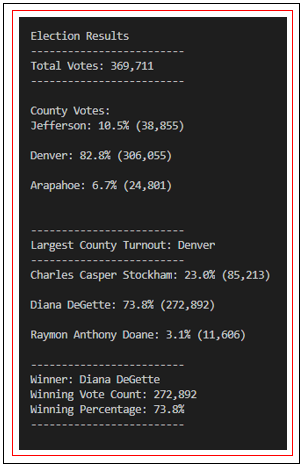
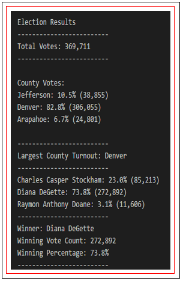
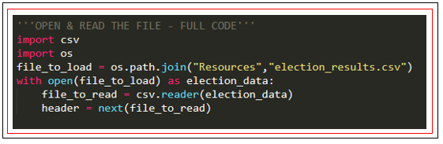
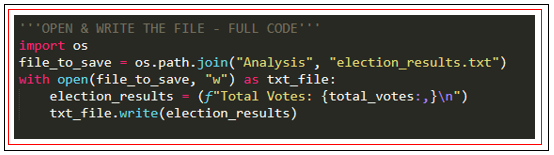

# Election Analysis for U.S. Congressional Precinct in Colorado

## Project Overview
### Purpose
The purpose of this analysis is to generate a vote count report to certify U.S. congressional race in a Colorado precinct and release the following.

   1. The **total number** of votes casted.
   2. The complete list of **counties** in the congressional precinct. 
      - The **percentage of votes from each county** out of the total count.
      - The **voter turnout for each county**. 
   3. The county with the **highest turnout**.
   4. The complete list of **candidates** who received votes. 
      - The **percentage of votes each candidate** won and 
      - The **total number of votes each candidate** received.
   5. The **winner of the election** based on popular vote.
   
<p align="left">

</p>
  
### Background
The results are gathered with three primary voting methods.
  1. **Mail-in ballots**, that are hand-counted at the central office.
  2. **Punch cards**, that are collected and fed into a machine that tabulates votes and then sends the results to the central office.
  3. **DRE** (direct-recording electronic counting) **memory cards**, that are read by a computer, and sent to the central office.

Altogether the votes casted by these methods determine the final election results. After the votes are counted, all results are gathered in a **csv file**. The file contains three columns with the following headers: **Ballot ID** (Column A), **County** (Column B), and **Candidate Name** (Column C).

## Resources

- Data Source: [election_results.csv](Resources/election_results.csv)

- Software: 

   - Python 3.7.7 
   - Visual Studio Code 1.47.3 
   
- Report: [election_results.txt](Analysis/election_results.txt)

## Results
### Per Candidate
- The analysis of the election shows that:
  - There were **369,711** votes cast in the election.
- The candidates were:
    - Charles Casper Stockham
    - Diana DeGette
    - Raymon Anthony Doane
- The candidate results were:
    - Charles Casper Stockham received **23.0%** of the vote and **85,213** of votes.
    - Diana DeGette received **73.8%** of the vote and **272,892** of votes.
    - Raymon Anthony Doane received **3.1%** of the vote and **11,606** of votes.
- The winner of the election was:
    - **Diana DeGette**, who received **73.8%** of the vote and **272,892** of votes.

### Per County
- The analysis of the election shows that:
- The counties results were:
    - Jefferson with a **10.5%** vote of the total count and **38,855** voter turnout.
    - Denver with an **82.8%** vote of the total count and **306,055** voter turnout.
    - Arapahoe with a **6.7%** vote of the total count and **24,801** voter turnout.
- The county with the largest voter turnout was:
    - **Denver** with an **82.8%** vote of the total count and **306,055** voter turnout.


<p align="center">
 
</p>

<p align="center">
An example of output from a command line in VS Code and in txt file.
</p>

### Overview of the methods and code
#### :o: Open, read & write the file
One of the most important things in data analytics is opening, reading, and writing a file. Opening and reading a file is the first step that needs to be done in order to start data analysis.

***1. Import dependencies.***

```python s=
import csv
import os
```

- `import csv` - allows to easily pull in data from external CSV files and perform operations on them. This dependency also includes the following functions:
   - `next()` - skips the row (most commonly used to skip a header row).
   - `reader()` - reads each row from the csv file and return data as a lists of strings (each row is a new list).
      
:exclamation: It is important to know how the data are returned after reading, and to know the properties of a dataset! `reader()`, returns data as a list (each row is a new list). Lists are mutable and ordered (indexed), so we can access (loop through) the elements via indexes.

- `import os` - allows to interact with the operating system. This dependency also includes the following functions:
   - `path()` - allows us to access files on different operating systems.
   - `join()` - joins file path components together when they are provided as separate strings; then, it returns a direct path with the appropriate operating system                              separator, forward slash for macOS or backward slash for Windows.

:exclamation: There is also a way to open a file with a direct path.  `file_to_load = 'Resources/election_results.csv'` In this case, we don’t need to import dependency `import os`, yet we need to provide exact path and save files in apropriate subfolders.

***2. Declare a variable, and load a file from the path.***

```python s=
file_to_load = os.path.join("Resources", "election_results.csv")
```
- `file_to_load` - declaring a variable for the file.
- `Resources` - directory of the file.
- `election_results.csv` - name of the file.

:exclamation: Directory has to be provided exactly, letter case matters.

***3. Open and read the file.***

```python s=
with open(file_to_load) as election_data:
   file_to_read = csv.reader(election_data)
```

- `with open()` - statement opens the file and ensures the proper acquisition of data without having to close the file, so the data isn’t lost or corrupted.
- `as <new_variable_name>` - assigning alias to a variable.
- `csv.reader()` - reads each row from the csv file and returns data as lists of strings. 
- `file_to_read` - a new variable that will be used in the for loop to access the elements via indexes.
- `election_data` - passing an argument to a function, a file that we want function to read.

:exclamation: Function `with open(file_to_load, “r”)` doesn’t have to be declared by method “r” as in “read mode”. Omitting the mode argument, Python opens the file in read-only mode by default (1).

***4. Declare and and skip the header row.***

```python s=
header = next(file_to_read)
```
- `next()` - function will skip first row in file_to_read.
Definition from official Python documetation: *Retrieve the next item from the iterator by calling its __next__() method. If default is given, it is returned if the iterator is exhausted, otherwise StopIteration is raised (2)*.

<p align="center">
A full code to open and read a file.
</p>

<p align="center">
 
</p>

***5. Additional code for writing a file.***

```python s=
file_to_save = os.path.join("Analysis", "election_results.txt")
```
This line of code will create a file *"election_results.txt"* in the *“Analysis"* folder if the file doesn’t exist yet. The folder must already exist, otherwise an error will occur.

```python s=
with open(file_to_save, "w") as txt_file:
```
In this function, we must specify the method `“w”` as in `write mode` in order to be able to write in a file. When using "w" method, Python will owerwrite existing contents if the file already exists. To avoid that, we can use `"a"` as in `append` method. If a file does not exist, it creates one, if a file has been created the data will be added to the file (3).

```python s=
txt_file.write(election_results)
```
With the Python function `write()` we declare what to write in a txt_file. txt_file is a new variable that is passed on from “original variable file_to_save”. In parentheses (election_results) is a name of a variable that contains data about what we want to write in a file.

<p align="center">
A full code to open and write a file.
</p>

<p align="center">
 
</p>

#### :o: Looping through dictionaries and the lists
In order to correctly retrieve elements or loop through specific data sets, it is essential to know their properties. Lists are mutable and ordered (indexing is possible). Dictionaries are mutable and unordered (indexing is not possible). Dictionary keys are immutable and has to be unique, while values are more flexible and can be mutable.

```python s=
   #Retrieving unique values with a conditional statement and membership operator (not in).
   if candidate_name not in candidate_options:

          #Appending new values(candidate_name) the list (candidate_options) with the append() method.
          candidate_options.append(candidate_name)
            
          #Creating a new key [candidate_name] in a dictionary (candidate_votes) and assigning a new value to its key by initializing the value `=0`.
          #And begin tracking key's value (candidate's voter count). 
          candidate_votes[candidate_name] = 0

   # Add a vote to that candidate's count. Indentation is important 
   # and it has to be aligned with if statement, otherwise values wouldn’t be increment properly.
   candidate_votes[candidate_name] += 1
```

*Note: this line of code is inside the `for loop`.*

#### :o: The get() method 

There are two ways to retrive values from a dictionary by its keys. With **"square brackets"** or with **"get()" method**:
with square brackets:
```python s=
for candidate_name in candidate_votes:
   votes = candidate_votes[candidate_name]
```
with get() method:
```python s=
for candidate_name in candidate_votes:
        votes = candidate_votes.get(candidate_name)
```
- `votes` - accessing/retrieving values with a new variable
- `candidate name` - dictoinary's key
- `candidate_votes` - dictionary

:exclamation: In both cases we are retrieving or accessing values from a dictionary based on their keys. There is a difference in syntax `[] brackets` vs `() parentheses` yet, the idea is the same. get() method looks up values in a dictionary, but unlike square brackets, get() returns "None" or a default value of your choice, if the key is not found. If you expect look-ups to sometimes fail, get() might be a better tool than normal square brackets look-ups because errors can crash your program (4).

#### :o: Finding a winner
The following code determines a winner based on the highest vote count. 

Declaring and initializing variables:
```python s=
winning_candidate = ""
winning_count = 0
winning_percentage = 0
```
Determine winning vote count, winning percentage, and candidate:
```python s=
if (votes > winning_count) and (vote_percentage > winning_percentage):
    winning_count = votes
    winning_candidate = candidate_name
    winning_percentage = vote_percentage
```           

All values *votes* are compared against each other by declaring a new variable `wining_count`. When the condition is  met and set to `True`, meaning the highest value is found, and the value is passed to the new variables `winning_count` `winning_candidate` ` winning_percentage`.

## Summary 
Writing scripts in Python has many advantages -- that is -- ***automating processes***, ***fast execution of the code***, and ***reusing the code*** for similar projects. This code quickly returns numerous data for a U.S. Congressional Precinct in Colorado, but can be easily used but for other elections as well.
This code will automatically:
- find candidates names,
- find counties,  
- count votes for each candidate and calculate vote %,
- count turnout per county and calculate their %,
- declare a candidate winner base on the highest vote count and %,
- declare a county with the highest turnout.

Using this code can be used on similar projects such as other congressional district elections, senatorial districts, local elections, and more.

- This code reads csv files but can be easily converted to read other files such as *json*, by importing other dependencies for example `import json`.
- This code reads candidate name on 2nd index and county on 1st index, but in case of a different structure of the data set this lines of codes `candidate_name = row[2]` and    `county_name = row[1]` can be easily converted.
- By importing dependency `datetime` we could perform real-time results for election in progress. `datetime` dependency will capture exact time when the analysis is executed.
- Since Python script finds unique names of candidates and counties we can reuse this code on a much larger dataset with more candidates, more counties or other areas.
- This code accesses the dataset in a specific directory and writes a report to a specific file, but this specific lines of codes  `file_to_load = os.path.join("Resources","election_results.csv")` and `file_to_save = os.path.join("Analysis", "election_analysis.txt")` can be easily fixed by renaming a directory and file in the code itself.

## References
(1) Eric Mathews. *Python Crash Course 2nd edition* SF: no starch press, 2019. Print (page 192).

(2) Build-in Functions, https://docs.python.org/3/library/functions.html#next, *Python Software Foundation*, Web 31 Jul 2020.

(3) "Module 3: PyCity Schools with Pandas." https://courses.bootcampspot.com/courses/200/pages/3-dot-4-2-open-and-read-files-using-python?module_item_id=57541, Trilogy Education Services, 2000. Web 31 Jul 2020.

(4) Udacity. *Intro to Python programming: Dictionaries and Indentety operators*,  https://classroom.udacity.com/courses/ud1110/lessons/c06382b2-cb27-4aac-a2bd-eb754fd13914/concepts/47a34480-110c-4cfa-be87-73278fc1a1e3, Web 31 Jul 2020.
